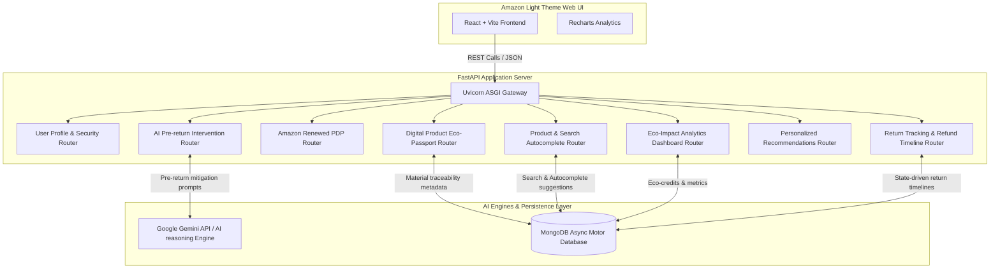

# ReLoop 🔄

> **Amazon Hackathon Project — Sustainable Returns, Recommerce & Circular Economy Platform**

ReLoop is a high-fidelity recommerce and returns management engine integrated directly into Amazon's ecosystem. Built to align with Amazon's light theme UI/UX standards, ReLoop addresses the multi-billion dollar returns crisis by introducing circular economy incentives, automated return mitigation via AI, product sustainability passports, and smart recommerce (refurbished/renewed) alternatives.

---

## 📐 Architecture Diagram



---

## 🌟 Key Features

1. **Amazon Integrated Search Autocomplete & Filter Bar**:
   - High-fidelity search bar with custom categories select and live suggestions panel matching Amazon's light headers.
2. **AI Pre-Return Prevention Engine**:
   - Leverages Google Gemini AI to resolve issues interactively before a user initiates a return (offering instant guides, troubleshooting tips, or custom recommerce swaps).
3. **ReLoop Eco Passport**:
   - Digital product passport disclosing material traceability, environmental footprint (carbon, water, waste saved), and lifecycle metrics.
4. **Smart Return & Refund Flow Tracker**:
   - State-driven, multi-phase horizontal tracking timelines reflecting refund milestones and recommerce redirections.
5. **Amazon Renewed Integration**:
   - Seamless electronics product page integration showcasing direct circular "Renewed Alternative" options alongside the primary listing.
6. **Eco Impact Dashboard**:
   - Dynamic user analytics mapping total credits earned, return reduction rates, and carbon offset logs using beautiful, synchronized charts.

---

## 🛠️ Technology Stack

| Layer | Technology | Description |
|---|---|---|
| **Frontend UI** | React 18, Vite | Lightning-fast builds, optimized SPA bundle |
| **Styling** | CSS Vanilla, HTML5 | Strict Amazon Light Design System styling |
| **Backend Engine**| FastAPI, Uvicorn | Async high-performance ASGI Python framework |
| **Database** | MongoDB | Highly flexible Document database |
| **DB Driver** | Motor | Async Python MongoDB client |
| **AI Reasoning** | Google Gemini / AI APIs | Natural language pre-return mitigation |
| **Visualization**| Recharts | Interactive SVG charting for eco-metrics |

---

## 🚀 Quick Start

### 1. Backend Setup
```bash
# Move into backend folder
cd reloop-backend

# Create and activate virtual environment
python -m venv venv
# On Windows (PowerShell):
.\venv\Scripts\Activate.ps1
# On macOS/Linux:
source venv/bin/activate

# Install dependencies
pip install -r requirements.txt

# Run the Uvicorn dev server (Automatically seeds MongoDB if empty)
uvicorn main:app --reload
# → API Health: http://localhost:8000/api/health
# → API Docs: http://localhost:8000/docs
```

### 2. Frontend Setup
```bash
# Move into frontend folder
cd reloop-frontend

# Install node dependencies
npm install

# Run Vite dev server
npm run dev
# → Web UI: http://localhost:3000
```

---

## 🧬 Repository Branching Strategy

To maintain clean code delivery and continuous verification:
* **`main`**: Production-ready, stable releases.
* **`dev/person1`**: Backend routes, MongoDB schemas, and AI service integrations.
* **`dev/person2`**: Frontend UI layouts, visual styling alignment, and interactive state management.

> [!NOTE]
> All branches are strictly synchronized, showing zero diffs across the entire project structure.
