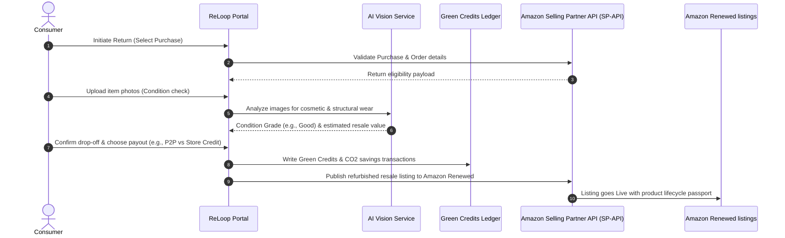

# ReLoop Circular Economy Platform — System Design Document

This document details the frontend architecture, high-level system integrations, database/ledger schemas, and state-machine transitions of the ReLoop platform.

---

## 1. Frontend Architecture & Component Topology

ReLoop is built using a component-driven architecture designed to separate styling, business/network logic, and global state management.

```mermaid
graph TD
    subgraph Global Context & State Layer
        CartContext[CartContext]
        UserContext[UserContext]
        ReturnContext[ReturnContext]
    end

    subgraph Custom Hooks (API & Query Adapter Layer)
        useProducts[useProductsHook]
        useCircularReturn[useCircularReturnHook]
    end

    subgraph Design System Primitives (src/components/ui)
        Button[Button]
        Card[Card]
        Badge[Badge]
        Modal[Modal]
        StarRating[StarRating]
        LoadingScreen[LoadingScreen]
    end

    subgraph Pages & Views
        Home[Home.jsx]
        Marketplace[ProductPage.jsx]
        Dashboard[Dashboard.jsx]
        ReturnFlow[ReturnFlow.jsx]
        Passport[PassportPage.jsx]
    end

    %% Context connections
    ReturnContext -.-> useCircularReturn
    UserContext -.-> Dashboard
    CartContext -.-> Marketplace

    %% Hooks connections
    useProducts --> Home
    useProducts --> Marketplace
    useCircularReturn --> ReturnFlow
    useCircularReturn --> Dashboard

    %% UI Primitives connections
    Button & Card & Badge & Modal & StarRating & LoadingScreen --> Pages & Views
```

### Core Patterns:
1. **Separation of Concerns**: UI views do not handle raw API requests or storage updates. Instead, they interact with **Custom Hooks** which orchestrate data fetching and update global context states.
2. **Design System Primitives**: All layouts consume standard elements from `src/components/ui/index.jsx` (e.g., `<Button>`, `<Card>`, `<Badge>`). This guarantees visual consistency and isolates design modifications (like height, color tokens, and hover states) to a single file.
3. **Optimistic Updates**: Contexts (like `UserContext`) update state locally prior to finalizing transactions on the backend, ensuring zero-latency transitions for high-frequency actions.

---

## 2. High-Level System Architecture & SP-API Ingestion

ReLoop operates as a middleware platform bridging consumer returns, AI-based verification, and Amazon Renewed resale channels.



### Key Integration Points:
* **Amazon SP-API (Orders & Listings)**: Validates purchases, fetches historical pricing, and creates pre-filled listings for graded items.
* **AI Vision Grading Engine**: Runs image classification models to determine wear levels ("Like New", "Good", "Fair"), producing a structural confidence score (e.g., 94%) and calculating an automated resale value offer.
* **Circular Passport Registry**: A decentralized or auditable ledger tracking the ownership history, condition score, and environmental metrics (CO₂ emissions offset) of products across multiple lifecycles.

---

## 3. Database & Ledger Schemas

### Return Ingestion & Grading Database
Stores the state of returns, including grading outcomes, chosen circular routes, and references.

```sql
CREATE TABLE return_orders (
    return_id VARCHAR(64) PRIMARY KEY,
    user_id VARCHAR(64) NOT NULL,
    product_id VARCHAR(64) NOT NULL,
    status VARCHAR(32) NOT NULL, -- e.g., 'initiated', 'graded', 'disposed', 'completed'
    disposition VARCHAR(32), -- e.g., 'refurbish', 'ngo_donate', 'p2p', 'recycle'
    condition_grade VARCHAR(16), -- e.g., 'like_new', 'good', 'fair'
    grade_confidence DECIMAL(3, 2),
    estimated_value DECIMAL(10, 2),
    refund_amount DECIMAL(10, 2),
    created_at TIMESTAMP DEFAULT CURRENT_TIMESTAMP,
    updated_at TIMESTAMP DEFAULT CURRENT_TIMESTAMP ON UPDATE CURRENT_TIMESTAMP
);
```

### Green Credits Ledger Transaction Schema
Maintains an immutable ledger of environmental credits and spent rewards.

```sql
CREATE TABLE green_credits_ledger (
    transaction_id VARCHAR(64) PRIMARY KEY,
    user_id VARCHAR(64) NOT NULL,
    amount DECIMAL(10, 2) NOT NULL, -- positive for earnings, negative for redemptions
    transaction_type VARCHAR(32) NOT NULL, -- 'earned_return', 'earned_purchase', 'spent_discount'
    notes TEXT,
    co2_saved_kg DECIMAL(8, 3) DEFAULT 0.000,
    timestamp TIMESTAMP DEFAULT CURRENT_TIMESTAMP
);
```

---

## 4. Return Workflow State Machine

The multi-step circular return wizard moves through a series of deterministic steps:

```mermaid
stateDiagram-v2
    [*] --> Step1: Product Selection
    
    Step1 --> Step2: Condition Assessment (Inputs)
    note right of Step1
        Loads order history from SP-API
    end

    Step2 --> Step3: Value Assessment (AI Grading)
    note right of Step2
        Requires upload of condition photos
    end

    Step3 --> Step4: Dropoff Selection
    note right of Step3
        Triggers AI Vision classification
        Calculates Green Credits & CO2
    end

    Step4 --> Step5: ReLoop Options (Payout/Resale selection)
    note right of Step4
        Selects home pickup or drop-off hubs
    end

    Step5 --> Step6: Confirmation
    note right of Step5
        Allows user to choose P2P Resale
        or immediate Store Credit
    end

    Step6 --> [*]: Return Completed
    note right of Step6
        Updates lifecycle passport
        Applies Green Credits to Wallet
    end
```
